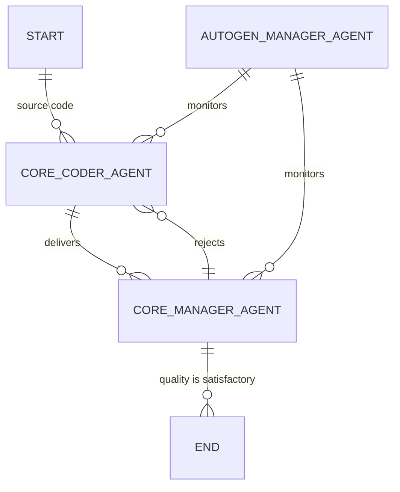
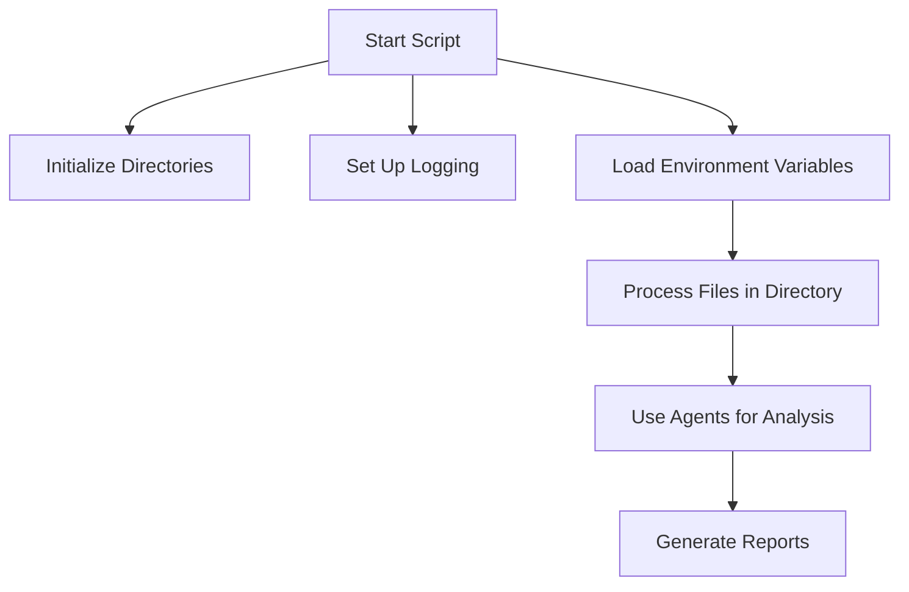
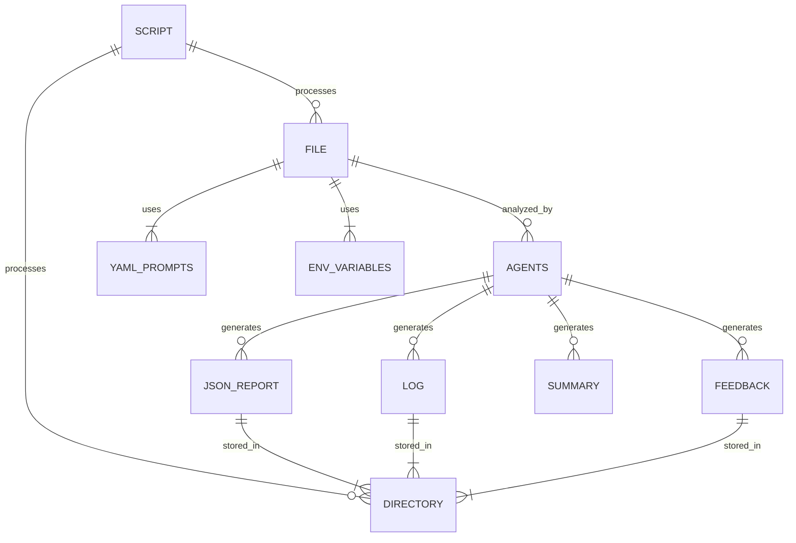

# Source Code Documentation Tool using Microsoft Autogen (v0.3.1).

## Microsoft Autogen GroupChat
- The group chat structure can also be represented in an Entity-Relationship Diagram (ERD) format below, illustrating how different agents interact with one another:



## Prerequisites

Ensure you have the following installed:

- Python 3.11 or later
- pip (Python package installer)
- Environment variables set for OpenAI API key (`OPEN_AI_API_KEY`)

Install necessary Python packages using:

```
pip install -r requirements.txt
```


## Summary

This script is a YAML-based project documentation tool that uses OpenAI and Microsoft Autogen Agents to scan a repository and generate documentation.

## Installation and Setup Guide

To set up the project environment:

1. **Clone the Repository**:

   ```
   git clone <repository_url>
   ```

2. **Navigate to the Directory**:

   ```
   cd <repository_directory>
   ```

3. **Install Dependencies**:

   ```
   pip install -r requirements.txt
   ```

4. **Set Environment Variables**:
   You can do this by creating a `.env` file in the root directory and adding the necessary keys:

   ```
   OPEN_AI_API_KEY=your_openai_api_key
   MODEL_NAME=your_model_name
   ```

## Additional Utility Script

A separate utility script is also included to generate Markdown reports from the JSON output files produced by the main script.

- **Script Location**: `./generate_markdown_reports.py`
- **Purpose**: This script reads JSON reports generated in the `./output/` directory and converts them into a Markdown format for easier readability and sharing.

### Running the Utility Script

```sh
python generate_markdown_reports.py
```

This will take all JSON files in the `./output/` folder and generate Markdown files in the `./reports/` directory.

## Usage Examples

To run the script and document the code:

```sh
python genmermaid.py <path_to_repository>
```

For example:

```sh
python genmermaid.py ./example_repo
```

The script:

- Initializes directories for reports, feedback, and logs, and sets up logging.
- Reads a YAML file for prompts, loads environment variables, and configures OpenAI settings.
- Processes files in a specified directory, calculates MD5 hashes, counts tokens, and uses agents to analyze the code.
- Generates reports in JSON format, logs errors, and prints summaries of the scan.

## Data Flow Diagram (DFD)

The simplified data flow of the script is illustrated below:



## Entity-Relationship Diagram (ERD)

The relationships between different components are shown below:



## Data Dictionary

Below is a dictionary detailing key components and functions used in the script.

### Script Components

- **reportsdir**: Directory to store JSON output reports.
- **feedbackdir**: Directory to store feedback JSON output.
- **logsdir**: Directory to store log files.
- **yamlfile**: Path to the YAML file containing prompts.
- **fecha1**: Timestamp for log file naming.
- **temperature**: Temperature setting for OpenAI model.
- **context\_size**: Maximum token context size.
- **semilla**: Random seed for trials.
- **api\_key**: API key for OpenAI access, loaded from environment variables.
- **model\_name**: Name of the model being used, loaded from environment variables.

### Functions

- **parse\_arguments**: Parses command-line arguments to determine which directory to scan.
- **load\_yaml\_file**: Loads YAML file containing prompts and configurations.
- **read\_file**: Reads a file and determines its encoding using `chardet`.
- **count\_tokens**: Counts tokens in a given text to ensure compliance with OpenAI's context size limitations.
- **calculate\_md5**: Calculates the MD5 hash of a file's contents for integrity checks.
- **save\_vulnerability\_report**: Saves the vulnerability report in JSON format, including metadata like filename, MD5 hash, and analysis duration.
- **save\_feedback\_report**: Saves feedback report in JSON format, which is used for improving agent prompts.
- **format\_duration**: Formats the total duration of the scan into hours, minutes, and seconds.
- **banner\_full**: Prints a summary banner after the scan is completed with details about scanned files, lines of code, tokens, and errors.
- **banner\_small**: Prints a concise summary banner during the scan.
- **main**: Initiates the scanning process by orchestrating all major functionalities.

### Classes and Agents

- **UserProxyAgent**: An agent that manages system-level messages and handles interactions without requiring human input.
- **AssistantAgent**: An assistant agent that helps in generating documentation based on prompts.
- **GroupChat**: Defines a chat structure involving multiple agents to facilitate collaborative analysis.
- **GroupChatManager**: Manages the flow of conversations between agents to ensure smooth transitions and information sharing.

### YAML Prompts Overview

The agents use the following YAML prompts to carry out their tasks:

- **target**: Describes the main objective of the script, which is "documenting source code in Mermaid.js."
- **simple\_start**: A JSON-formatted message that initiates the process for the `core_coder_agent` to start documenting.
- **core\_coder\_agent**: Detailed instructions for the core agent responsible for generating visual diagrams from input data using Mermaid.js. It emphasizes the agent's ability to transform complex data into elaborate, easy-to-understand diagrams.
- **core\_manager\_agent**: This agent reviews the diagrams generated by the `core_coder_agent` to ensure accuracy and adherence to the original information. It also provides corrective feedback if necessary.
- **example\_schema**: JSON schema that defines the structure for agent responses, ensuring consistency.
- **example\_mermaid**: Contains example diagrams in Mermaid.js syntax to guide agents in generating diagrams.
- **output\_example**: A structured example of the output expected from the core coder agent, illustrating summary, diagrams, data dictionary, and context.

## Code Context

The following sections summarize different contexts and processes used within the code:

### Initialization

**Description**: Sets up directories, logging, and loads configuration.

**Actions**: Creates directories for reports, feedback, and logs. Sets up a logging mechanism. Loads YAML prompts and environment variables. Configures OpenAI settings and initializes necessary agents.

### File Processing

**Description**: Processes files in the specified directory.

**Actions**: Reads files, calculates MD5 hashes, counts tokens, and uses agents for analysis. Skips unnecessary files and handles encoding issues.

### Agent Interaction

**Description**: Uses OpenAI and Microsoft Autogen Agents for code analysis.

**Actions**: Configures agents with prompts and settings from YAML files. Initiates chat for analysis using GroupChat and GroupChatManager. The `core_coder_agent` generates visualizations in Mermaid.js format, while the `core_manager_agent` reviews and ensures the accuracy of these visualizations. If revisions are needed, the process iterates until satisfactory results are achieved.

### Reporting

**Description**: Generates and saves reports based on analysis.

## Output Files Description

The script generates several types of output files, which are stored in designated directories:

- **Reports Directory (********`./output/`********\*\*\*\*\*\*\*\*)**: Contains JSON reports summarizing vulnerabilities or findings from each file analyzed.
- **Feedback Directory (********`./feedback/`********\*\*\*\*\*\*\*\*)**: Stores feedback output, used for improving prompts and providing insights for future scans.
- **Logs Directory (********`./logs/`********\*\*\*\*\*\*\*\*)**: Logs details of the scanning process, including errors, skipped files, and general operation details.

Each output includes relevant metadata, such as filenames, scan duration, token count, and analysis results.

## License

This project is licensed under the MIT License. See the LICENSE file for more details.

**Actions**: Saves vulnerability and feedback reports in JSON format. Logs errors and prints scan summaries. Uses generated reports for improvements in future scans.

## Author Information

- **Author**: Nic Cravino
- **Email**: [spidernic@me.com](mailto\:spidernic@me.com) 
- **LinkedIn**: [Nic Cravino](https://www.linkedin.com/in/nic-cravino)
- **Date**: October 26, 2024

Feel free to suggest more improvements or provide feedback on specific sections. This document aims to make it easy to understand the functionality and workflow of the script.

