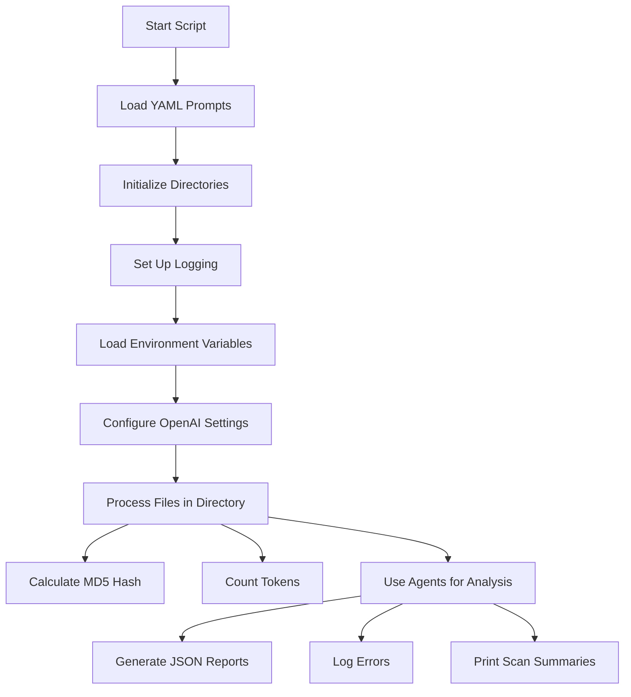
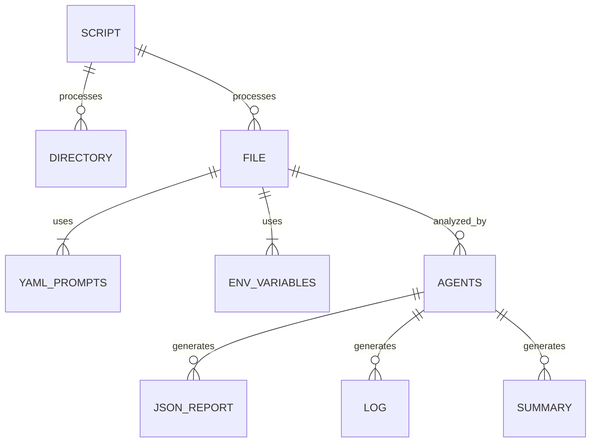

# Summary

The script is a YAML-based project documentation tool that uses OpenAI and Microsoft Autogen Agents to scan a repository and generate documentation. It initializes directories for reports, feedback, and logs, and sets up logging. It reads a YAML file for prompts, loads environment variables, and configures OpenAI settings. The script processes files in a specified directory, calculates MD5 hashes, counts tokens, and uses agents to analyze the code. It generates reports in JSON format, logs errors, and prints summaries of the scan.

## Data Flow Diagram

## Entity Relationship Diagram

## Data Dictionary

| Component | Field | Description |
|-----------|-------|-------------|
| Script | reportsdir | Directory to store JSON output reports. |
| Script | feedbackdir | Directory to store feedback JSON output. |
| Script | logsdir | Directory to store log files. |
| Script | yamlfile | Path to the YAML file containing prompts. |
| Script | fecha1 | Timestamp for log file naming. |
| Script | temperature | Temperature setting for OpenAI model. |
| Script | context_size | Maximum token context size. |
| Script | semilla | Random seed for trials. |
| Functions | parse_arguments | Parses command-line arguments. |
| Functions | load_yaml_file | Loads YAML file containing prompts. |
| Functions | read_file | Reads a file and determines its encoding. |
| Functions | count_tokens | Counts tokens in a given text. |
| Functions | calculate_md5 | Calculates MD5 hash of a file's contents. |
| Functions | save_vulnerability_report | Saves the vulnerability report in JSON format. |
| Functions | save_feedback_report | Saves feedback report in JSON format. |
| Functions | format_duration | Formats the total duration of the scan. |
| Functions | banner_full | Prints a summary banner after the scan is completed. |
| Functions | banner_small | Prints a concise summary banner during the scan. |
| Functions | main | Initiates the scanning process. |

## Code Context

| Function | Description | Error Handling | Output |
|----------|-------------|----------------|--------|
| Initialization | Sets up directories, logging, and loads configuration. | N/A | N/A |
| File Processing | Processes files in the specified directory. | N/A | N/A |
| Agent Interaction | Uses OpenAI and Microsoft Autogen Agents for code analysis. | N/A | N/A |
| Reporting | Generates and saves reports based on analysis. | N/A | N/A |

## Scan Information

| Filename | File Path | Scan Date | Scan Duration (s) | MD5 Hash | Total Tokens | Total Cost (USD) | Lines of Code | Scan Type |
|----------|-----------|-----------|------------------|----------|--------------|-----------------|---------------|-----------|
| genmermaid.py | test | 2024-11-08T16:43:53 | 12.10 | 3805cb25b0ea00fd34951182da4252eb | 6207 | $0.02176 | 382 | DOCUMENTING SOURCE CODE IN MERMAID.JS
 |
